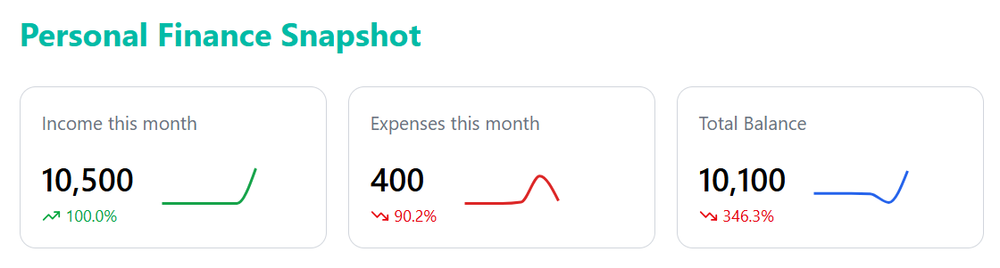
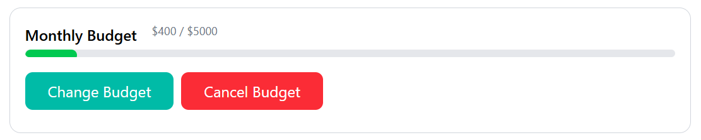
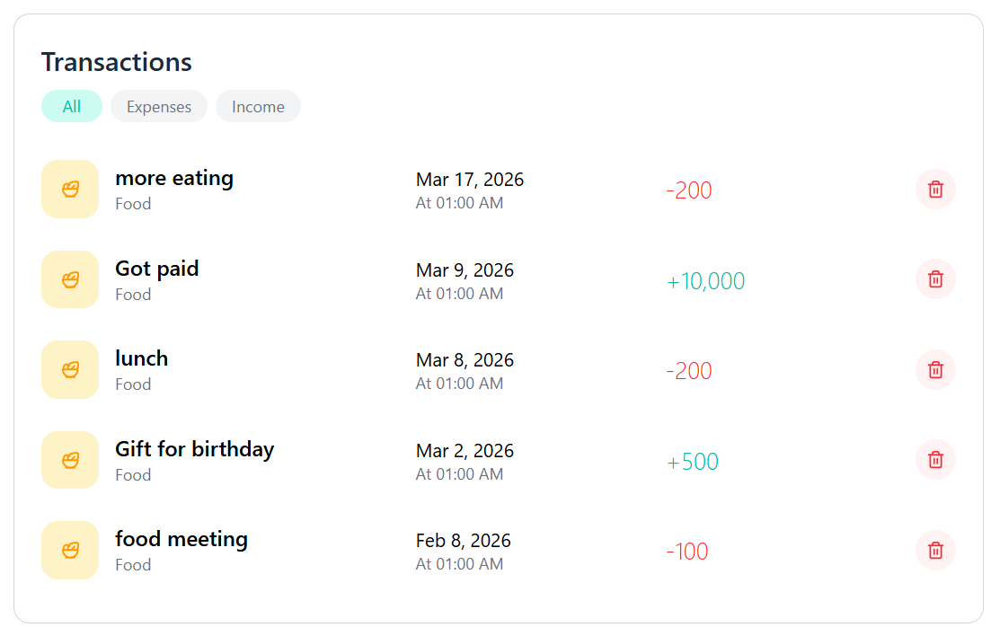
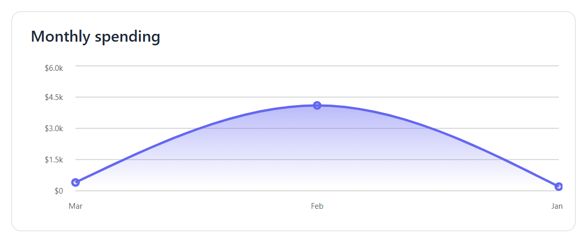
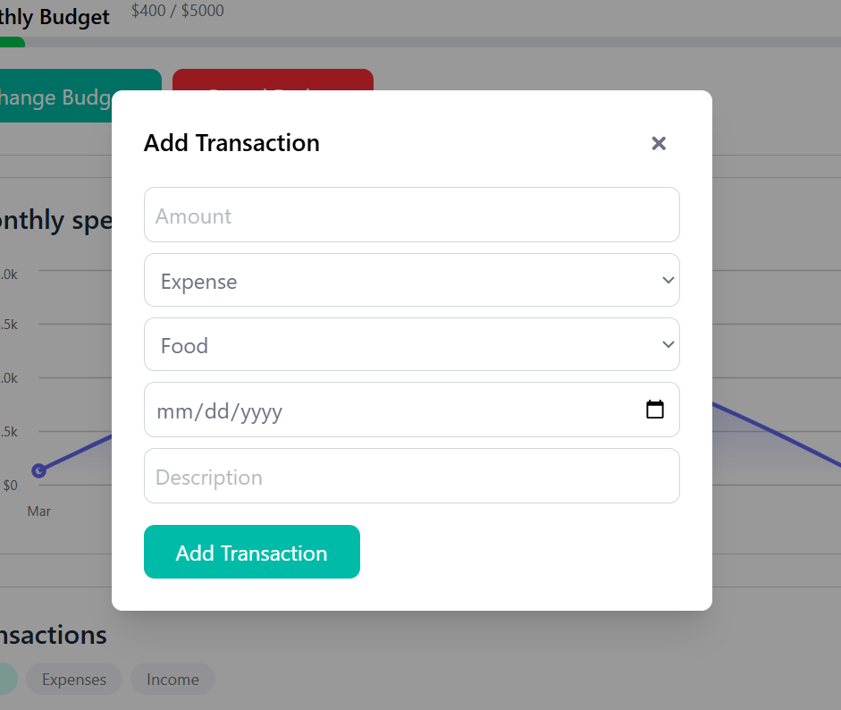

# Personal Finance Snapshot (Option A)



A **personal finance tracking application** built with **React and Zustand** that helps users record transactions, monitor spending, and manage a monthly budget.

Personal finance applications typically allow users to track income and expenses, categorize transactions, and visualize spending patterns to better understand and control their financial habits. ([Medium][1])

---

# Features

## Transaction Management

Users can record financial transactions with the following details:

* Amount
* Type (Income or Expense)
* Category ()
* Date
* Description

Transactions are stored locally and displayed in a transaction list for easy review.

---

## Monthly Budget

The application allows users to:

* Set a **budget for the current month**
* Track how much money has been spent within that month
* Automatically remove the budget when a new month begins

The budget system ensures that only transactions from the same month as the budget are used in the spending calculation.

Users can also:

* Update the budget amount
* Cancel the budget completely

---

## Budget Progress Indicator



The application includes a **visual progress bar** that shows how much of the monthly budget has been used.

Color indicators:

* **Green** → Safe spending
* **Yellow** → Approaching limit
* **Red** → Budget almost exhausted

This allows users to quickly understand their financial position.

---

## Transaction History



The application includes a **visual progress bar** that shows how much of the monthly budget has been used.

Color indicators:

* **Green** → Safe spending
* **Yellow** → Approaching limit
* **Red** → Budget almost exhausted

This allows users to quickly understand their financial position.

---

## Expense Filtering by Month

When calculating spending, the application only includes:

* Transactions marked as **expenses**
* Transactions that belong to the **same month as the active budget**

This ensures accurate monthly spending calculations.

---

## Charts and Financial Insights



The dashboard provides a chart that help users visualize:

* expenses trend

Visual analytics help users understand spending behavior and identify patterns.

---

## Transaction Modal


Transactions are created through a modal interface that allows users to quickly add financial records without leaving the dashboard.

The modal is controlled through a global Zustand store, allowing any component to open or close it.

---

## Data Persistence

All financial data is stored using **LocalStorage**, meaning:

* No backend server is required
* Data remains available after page refresh
* The application works fully offline as requested

---

# Tech Stack

## Frontend

* React
* Vite
* TailwindCSS

## State Management

* Zustand
* useState

## Icons

* Lucide React

---

# Project Structure

```
src
│
├── components
│   ├── Dashboard.jsx
│   ├── AddTransaction.jsx
│   ├── TransactionList.jsx
│   ├── Charts.jsx
│   ├── Budget.jsx
│   └── sub-components
│       └── Button.jsx
│
├── store
│   └── financeStore.js
│
├── App.jsx
└── main.jsx
```

---

# Installation

Clone the repository:

```bash
git clone https://github.com/OtiHillary/finance-tracker.git
```

Navigate into the project directory:

```bash
cd finance-tracker
```

Install dependencies:

```bash
npm install
```

Start the development server:

```bash
npm run dev
```

---

# How It Works

## Adding Transactions



Users can create a transaction by opening the transaction modal and entering:

* Amount
* Transaction type
* Category
* Date
* Description

The transaction is saved to the Zustand store and persisted in LocalStorage.

---

## Budget creation


When a user sets a budget:

```
{
  month: "YYYY-MM",
  amount: number
}
```

Example:

```
{
  month: "2026-03",
  amount: 500
}
```

Only transactions with dates that match this month are used when calculating spending.

Example comparison:

```
Transaction Date: 2026-03-10
Budget Month: 2026-03
Match → Included
```

```
Transaction Date: 2026-02-25
Budget Month: 2026-03
No Match → Ignored
```

---

# Future Improvements

Potential improvements include:

* Editing transactions
* Category customization
* Multi-month budget history
* Data export (CSV / JSON)
* Authentication and cloud sync
* Recurring transactions
* Dark mode

---

# Author

O. Hillary -
Software Engineer

---
